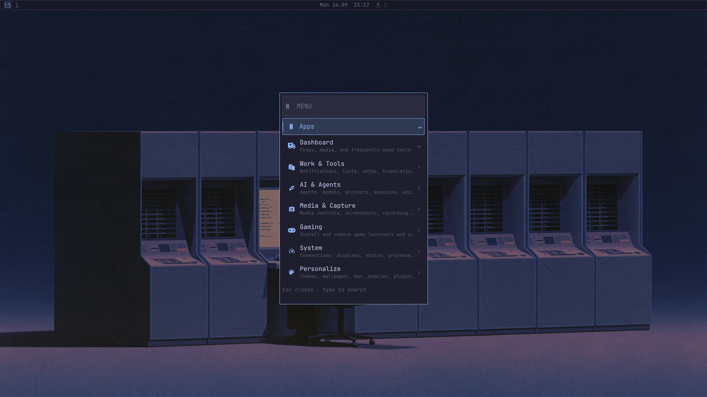
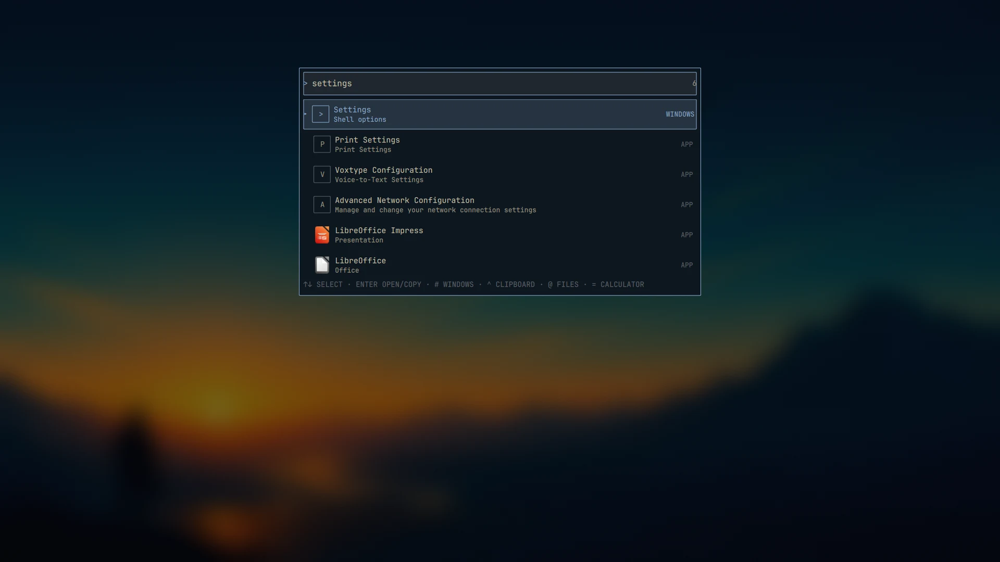
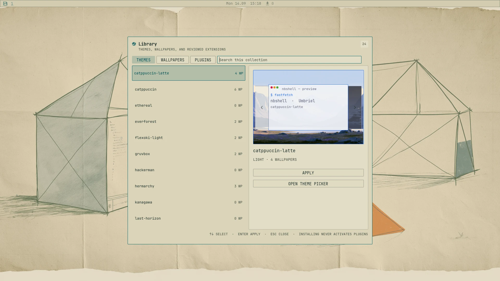
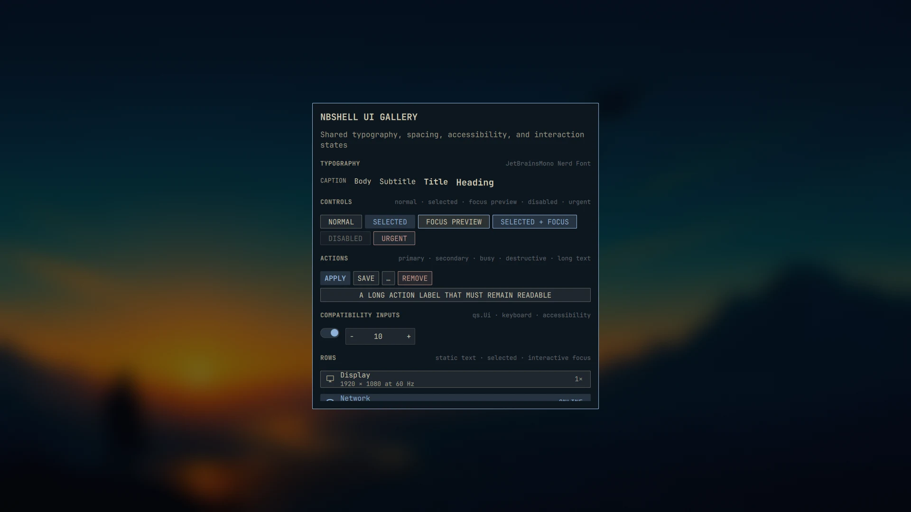

# nbshell

nbshell is an independent desktop shell for the
[Umbriel](https://github.com/noctalia-dev/umbriel) Wayland compositor. It is built with
[Quickshell](https://quickshell.org) and takes visual inspiration from
[Omarchy](https://omarchy.org). It does not require a full desktop environment.

> nbshell is an independent project. It is not affiliated with, endorsed by,
> or an official part of Omarchy, Umbriel, or Quickshell. Project names are used
> only to describe inspiration, provenance, and compatibility.

The project was created with AI-assisted development. Product decisions,
testing, and the direction of the project remain human-led.

> nbshell is an active beta; commands, configuration, and features may still
> change before the stable release.

Current prerelease: **0.1.0-beta.10**. See the
[changelog](CHANGELOG.md) for user-facing changes.



## Why nbshell?

- **Native Umbriel workflow:** use scrolling, dwindle, and master layouts,
  overview, workspace controls, and output management through one integrated
  shell workflow.
- **One theme across the desktop:** import compatible Omarchy themes or use the
  bundled independent collection; nbshell keeps the bar, menus, terminal,
  browser accents, lock screen, and wallpaper language coherent. The optional
  theme hook can also generate and live-update a matching Hermes Agent skin.
- **Linux tools remain Linux tools:** nbshell coordinates NetworkManager,
  PipeWire, systemd, grim, OBS, KDE Connect, and other existing components
  instead of replacing them with a closed desktop stack.
- **Desktop and phone can work together:** optional Android mirroring, phone
  webcam, nearby sharing, synchronized tasks, wallpapers, habits, and quick
  notes are available without making a phone mandatory.
- **Inspectable extensions:** bundled and third-party plugins expose their
  source, license, dependencies, and permissions; new plugins start disabled.
- **Safe shell updates:** the dashboard checks published nbshell releases,
  shows their notes, and verifies the release checksum before the normal,
  data-preserving installer runs in a visible terminal.
- **Reviewed external sources:** `nbshell upstream-audit` checks pinned upstream
  projects without changing local code. A persistent three-day user timer only
  notifies when a manual compatibility review is needed; external QML is never
  updated automatically.
- **Keyboard first, mouse friendly:** the searchable menu reaches nested
  actions and installed applications, while major surfaces are also available
  through documented shortcuts and CLI commands.
- **Useful without another daemon:** one lazy Library brings installed themes,
  wallpapers, and reviewed plugins together, while launcher providers search
  windows, clipboard history, calculations, and files on demand.

| Launcher | Library | UI Gallery |
| --- | --- | --- |
|  |  |  |

## Documentation

- [Manual](docs/index.md) — setup, features, browser themes, and video trimming
- [Getting started](docs/getting-started.md) — install, first login, and checks
- [Installation strategy](docs/distribution.md) — one-command bootstrap,
  packaging roadmap, and the private ISO experiment
- [Private ISO testing](docs/iso-testing.md) — QEMU-first destructive-installer
  safeguards and publication blockers
- [Compatibility](docs/compatibility.md) — supported baseline and beta limitations
- [Beta testing](docs/beta-testing.md) — clean-machine and hardware checklist
- [Join the public beta](docs/beta-invitation.md) — tester profile, feedback, and media plan
- [Troubleshooting](docs/troubleshooting.md) — health checks and recovery
- [Support](SUPPORT.md) — help, diagnostics, and responsible contact paths
- [Privacy](PRIVACY.md) — local data, network access, and external services
- [Security](SECURITY.md) — private vulnerability reporting
- [Plugin development](docs/plugin-development.md) — manifest, lifecycle, safety, and publishing
- [Plugin store](docs/plugin-store.md) — catalog format and review policy
- [Feature guide](docs/features.md) — what each part of nbshell does
- [Library, search, and demos](docs/library-search-and-demos.md) — unified content,
  launcher prefixes, safe reports, and focused recording
- [Phone webcam](docs/phone-webcam.md) — use an Android camera in OBS or calls

The manual is intentionally split into short pages so it can grow into a clear
online guide without turning this README into a wall of text.

## What does it include?

- Island, pill, or full-width bar with freely arranged modules
- Searchable menu, application launcher, dashboard, themes, and wallpapers
- Clipboard history, notification center, and system tray
- Audio mixer, media controls, Bluetooth, Wi-Fi, batteries, power profiles,
  and persistent Umbriel display management
- Floating Picture-in-Picture controls for Zen Browser
- Optional Zen live-theme bridge after one initial browser restart
- Native Orbital session locker with dedicated PAM authentication, secure
  lock-before-suspend, crash recovery, and Hyprlock as an independent fallback
- Optional native Orbital greetd login screen with a password-first PAM service
  and an independent compositor-free agreety recovery configuration
- Optional biometric phone approval for the next `sudo` or Polkit action, with
  explicit per-service activation and password authentication retained
- Calendar, tasks, quick notes, habits, KDE Connect, Android mirroring, and a phone webcam
- A local-draft shopping-list tool that formats free text and sends the
  confirmed checklist to one exact WhatsApp group through optional `wacli`
- Switchable WhatsApp integration: native client or the retained PrettyZap fallback
- Screenshots, screen recording, OCR, QR scanning, and an animated screen saver
  using `ttfx` 0.3.2+ when available, with Python and built-in fallbacks
- AI usage for Codex, Claude, Antigravity, and other providers
- Curated plugin manager with optional modules, dependency details, update
  previews, and managed removal of external plugins
- A read-only Plugin Porting Lab that inspects bounded public source text,
  identifies Umbriel and nbshell compatibility work, never executes or installs
  the analyzed plugin, and can hand a suitable report to the configured coding
  agent with a guarded implementation prompt
- Agent Center with a default-agent launcher, explicit approval profiles,
  project selection, Herdr sessions, optional Ollama/OpenCode routing, and an
  isolated multi-provider Hermes workflow with human-controlled apply and push
- Umbriel key bindings, terminal colors, and systemd autostart
- Optional herdr status inside the System & Plugins dashboard
- A release-based nbshell updater, kept separate from system and plugin updates

## Requirements

You need:

- Arch Linux or an Arch-based distribution
- A working Arch Wayland session or TTY from which Umbriel can be installed
- Git and an internet connection
- A normal user account with `sudo` access for package installation

The setup script installs Quickshell, the Nerd Font, and the other packages
used by the included modules. Optional hardware features only work when their
matching services or devices are available.

## Simple installation on Arch Linux

Open a terminal as your normal user. Starting from an existing Wayland session
is convenient but not required. Do not run the script as root.

### One-command bootstrap

Download the bootstrap script, then let it select, verify, and run the latest
published beta installer:

```bash
curl -fsSL https://raw.githubusercontent.com/nerdislb/nbshell/main/bootstrap.sh -O && bash bootstrap.sh
```

> The bootstrap requires the Sigstore bundle produced by the new release
> workflow. Releases published before that workflow are intentionally skipped;
> until the next signed beta is published, use the Git-clone installation below.

This deliberately downloads to a file instead of piping network content into a
shell. `bootstrap.sh` verifies the release workflow's Sigstore signature and
the archive's SHA-256 checksum, safely extracts it, and starts the same
`setup.sh` flow described below. Use `bash bootstrap.sh --full` for all optional desktop tools,
or `--channel stable` after a stable release exists. Verification is bound to
the exact tag and pinned release workflow. On Arch the bootstrap installs the
repository-signed `cosign` package first when needed.

### From a Git clone

```bash
git clone https://github.com/nerdislb/nbshell.git
cd nbshell
./setup.sh
```

The script installs Umbriel and its screenshot/screencast portal from their
official source repositories and deploys nbshell. It shows packages before
calling `sudo`. Optional tools
remain discoverable but disabled. Use
`./setup.sh --full` when you want the complete capture, calendar, sync, power,
and hardware tool set in one pass.

When setup has finished, log out and choose **Umbriel** in the greeter. Refresh
shell autostart and the compositor integration with:

```bash
nbshell switch on
```

Then log out and back in. You can also start it immediately without logging
out:

```bash
nbshell start -d
```

Check the installation with:

```bash
nbshell switch status
```

## Install files only

If you manage packages yourself, use:

```bash
./install.sh
nbshell start
```

`install.sh` stages and validates the shell before an atomic runtime switch. A
single-writer lock prevents concurrent updates; restart recovery and rollback
keep an existing desktop usable if installation is interrupted or the new
shell does not stay active. It reports missing programs but does not install
packages.

The installer keeps an existing Umbriel configuration and writes only
nbshell-owned includes. Existing personal nbshell settings are not overwritten
during later installations.

## First commands

```bash
nbshell menu             # Open the main menu
nbshell settings         # Change appearance and behavior
nbshell modules          # Arrange bar modules
nbshell plugin-manager   # Manage installed and optional plugins
nbshell plugin-store     # Browse the curated plugin catalog
nbshell store            # Browse themes, wallpapers, and plugins together
nbshell shopping         # Format and send the shopping list
nbshell system-report    # Print a privacy-conscious diagnostic map
nbshell demo start       # Record a focused shell demo
nbshell keys             # Show key bindings
nbshell dashboard        # Open the dashboard
nbshell display          # Configure connected displays
nbshell whatsapp status  # Show the selected WhatsApp provider
nbshell aether status    # Check the native Aether Apply bridge
nbshell ui-gallery       # Preview shared interface components
nbshell pip status       # Check Zen Picture-in-Picture
nbshell --help           # Show every command
```

The shopping-list sender resolves one exact WhatsApp group. It defaults to
`Einkauf`; choose another synchronized group without editing source code:

```bash
nbshell set shoppingListTarget 'Groceries'
```

The native WhatsApp provider is an optional local-first client backed by
`wacli`. Install and
link it with `nbshell whatsapp setup` and `nbshell whatsapp auth`. The default
shortcut, `Mod+Shift+M`, follows the selected provider. During a trial you can
switch back without uninstalling either client:

```bash
nbshell whatsapp provider prettyzap
nbshell whatsapp provider whatsapp
```

Zen Browser opens its native Picture-in-Picture window with `Ctrl+Shift+]`.
nbshell makes that window floating and remembers its size. Use the `PIP` module
or `Mod+Alt+P` to cycle its Umbriel width; move it directly with Umbriel's
floating-window pointer controls.

## Wallpapers

Fresh installs include an original nbshell starter collection and enable the
Tokyo Night default wallpaper. The picker searches every theme collection,
so choosing a Gruvbox, Nord, or custom image never changes the active color
theme:

```bash
nbshell wallpaper pick
```

Collections live below `~/.local/share/nbshell/wallpapers/<theme>/`; synced
personal collections may use `~/Sync/nbshell/wallpapers/<theme>/`. An existing
Omarchy installation is not copied automatically. To reuse its images without
redistributing them, copy the desired files from `/usr/share/omarchy/themes/`
or `~/.config/omarchy/themes/` into an nbshell collection directory. The
picker discovers them the next time it opens.

Use the visible `CURRENT THEME` / `ALL` switch, or press `Tab`, to alternate
between the active theme's collection and the complete library. The picker
remembers the selected scope.

## Displays

Open `Displays` from the main menu, the Control Center, or run
`nbshell display`. The panel uses modes reported by the active compositor and can change each
output's resolution, scale, orientation, enabled state, and position relative
to another display. Changes apply live through Umbriel and are saved in
nbshell-owned Umbriel includes; nbshell never rewrites the
rest of your compositor configuration. It refuses to turn off the only active
output.

The same backend is available without the shell UI:

```bash
nbshell display status
nbshell display set DP-1 scale 1.5
nbshell display set DP-1 transform 90
nbshell display place DP-1 right eDP-1
```

## Workspace layouts

Press `Mod+Backspace` or run `nbshell layout toggle` to cycle Umbriel's
scrolling, dwindle, and master layouts for the focused workspace. Select one
directly with `nbshell layout scrolling|dwindle|master`.

## AI agents and local models

Press `Mod+Shift+A` to open the default agent immediately in a focused floating
terminal. It starts in `~/projects/nbshell` when that checkout exists, so the
installed nbshell skill can guide customization. The full Agent Center remains
available through `AI & Agents`, a right-click on AI usage,
`Mod+Ctrl+Shift+A`, or the CLI:

```bash
nbshell agent center
nbshell agent doctor
nbshell agent list
nbshell agent default codex
nbshell agent quick
nbshell agent launch --project ~/projects/my-project
nbshell agent install copilot
nbshell agent hermes-provider claude
nbshell agent hermes-mode research
nbshell agent hermes-broker setup
nbshell agent hermes-job list
nbshell commands --json
```

Clicking the AI bar module opens a provider-focused dashboard for Codex, Claude,
and configured Antigravity usage. It combines subscription windows and reset
times with local seven-day and per-model token summaries. The local scanner
reads token metadata from installed CLI session logs but never renders or
exports prompt content. Switch providers with the tabs, arrow keys, mouse wheel,
or middle click; right click launches the configured default agent.

The Agent Center discovers supported tools instead of requiring all of them.
It currently recognizes Codex, Claude Code, Antigravity, OpenCode, Gemini CLI,
GitHub Copilot, Pi, and an optional isolated Hermes pilot. Hermes is launched
inside a dedicated workspace with only workspace-file operations enabled;
gateway, terminal, browser, memory, cron, messaging, delegation, and bundled
skills remain disabled until they receive a separate security review. `safe`,
`balanced`, and
`autonomous` approval profiles map to
each tool's native controls. The explicitly selected `autonomous` profile uses
Codex's full approval-and-sandbox bypass; fresh installations therefore
continue to start in the safer `balanced` profile.

The Hermes Hub keeps provider choice separate from permissions. Codex and
Claude run as native Hermes providers using their provider-owned CLI credential
stores. Gemini is clearly marked as an external bridge and opens the existing
Antigravity CLI in its sandbox, because Hermes cannot reuse Antigravity's Google
login. `restricted` exposes workspace-file operations, `research` adds
read-only web tools, and `workspace` adds the terminal while retaining Hermes'
manual approval policy. The shipped and migration-safe default remains
`codex` plus `restricted`. Recent Hermes sessions are listed by opaque ID,
timestamp, and token count; prompt text and generated titles stay out of the
shell status path.

`trusted` is the explicit daily-development mode. Unlike the pilot modes, a
normal Hermes launch starts directly in the user's home directory, matching
the other agents. An explicit project launch starts in that directory instead.
It enables files, web, terminal, code execution,
task planning, clarification, delegation, session search, skills, and the
nbshell provider broker. Normal edits, builds, tests, and multi-agent work can
therefore happen against the real project. Trusted is explicitly autonomous:
native Hermes receives `--yolo`, while the external Gemini lane receives its
equivalent permission bypass. Commands therefore do not stop for approval.
The write-safe root is Home for a normal launch or the selected directory for
an explicit project launch, while terminal tools can use required build tooling
and caches. Restricted remains the shipped default;
Trusted must be deliberately selected by the user. In Agent
Center, right-clicking a project launches Hermes there; left click retains the
default-agent behavior. Android Studio projects are discovered automatically.

The optional Hermes broker has two deliberately separate surfaces. Its
`ask_codex`, `ask_claude`, and `ask_gemini` tools exchange bounded advisory text
only. Calls are serialized, rate-limited, time-limited, output-limited, and
logged without prompt or response content. Codex and Claude run through
tool-minimal nested Hermes queries; Gemini runs inside a bubblewrap filesystem
boundary with only its minimum CLI authentication state mounted.

Transactional tools can start Codex, Claude, or Gemini on an implementation in
a disposable local Git clone. They never receive the real repository's Git
metadata, SSH keys, or system write access. A different provider must review
the resulting normalized commit before it becomes eligible for application.
Hermes may start transactions only for repositories below `~/projects`, and no
more than three jobs can run concurrently. Each sandbox sees only the selected
provider's read-only authentication state; provider runtime homes are separate.
Hermes and its MCP tools cannot apply, install, push, or reject a transaction:
those operations exist only in the human-facing Agent Center and
`nbshell agent hermes-job`, require an explicit confirmation, fail closed when
the source branch moved or is dirty, and retain an action audit. The Agent
Center shows job state, diff, review verdict, and separately armed Apply,
Install, Push, and Reject controls. Enable the broker explicitly with
`nbshell agent hermes-broker setup` and restart Hermes.

For larger goals, Hermes can start a supervised team with up to three
non-overlapping tasks. Codex, Claude, and Gemini work in parallel transaction
clones; another provider reviews every result, and a rejected review triggers
at most two bounded revisions. Approved commits meet only in a disposable
integration clone, where allowlisted checks run without network, home-directory
access, or provider credentials. Integration conflicts are repaired there,
never in the source checkout. The Agent Center shows overall progress, elapsed
time, provider, attempt, and check state, and supports pause, reboot-safe
resume, cancel, and final approval. Even a completed team stops at
`AWAITING_APPROVAL`: Apply, Install, and Push are separate, double-confirmed
human actions. Only one team and at most three transaction workers run at once;
runtime and revision depth are bounded.

Confirmed knowledge can follow a separate reviewed Second Brain proposal path.
Hermes submits either an `append` section for an existing note or a complete
`create` note below `01_Projects`, `02_Knowledge`, `03_Daily`, or `04_Inbox`.
Neither Hermes nor the independent reviewer receives vault access: the review
workspace contains only the proposed Markdown. `00_Meta`, `05_Sources`,
non-Markdown files, replacements, traversal, symlinks, and credential-like
content are rejected. A review may request two bounded revisions. The Agent
Center then shows the target, verdict, and exact proposal diff. Apply verifies
that the target has not changed, commits only that note while preserving other
working-tree changes, and Push remains a separate double-confirmed human
action. The MCP tools can prepare, revise, and inspect proposals, but cannot
apply, commit, reject, or push them.

Model profiles route a default launch without changing individual agent
commands. `local` and `private` route through OpenCode, while `fast` and
`strong` default to Codex and Claude. Advanced users can set a concrete
OpenCode model in `~/.config/nbshell/agents.json`, for example:

```json
{
  "modelProfiles": {
    "local": { "agent": "opencode", "model": "ollama/qwen3.5:4b" }
  }
}
```

Ollama is optional and can be controlled after installation with
`nbshell agent ollama start|stop`. nbshell does not store provider credentials
or conversation history. The installer links one bundled nbshell system skill
into the standard Agent Skills locations used by Claude Code, Codex, and Pi,
plus the shared directory discovered by Gemini CLI and OpenCode. Check discovery with
`nbshell agent skills`; invoke it as `/nbshell` in Claude Code, `$nbshell` in
Codex, or through the respective agent's skills picker. Agents may also load it
automatically when a task matches its description.

To expose an Ollama model to OpenCode, add a local provider to
`~/.config/opencode/opencode.jsonc`:

```jsonc
{
  "$schema": "https://opencode.ai/config.json",
  "provider": {
    "ollama": {
      "npm": "@ai-sdk/openai-compatible",
      "name": "Ollama (local)",
      "options": { "baseURL": "http://127.0.0.1:11434/v1" },
      "models": {
        "qwen3.5:4b": { "name": "Qwen 3.5 4B (local)" }
      }
    }
  }
}
```

Then run `ollama pull qwen3.5:4b` and verify the route with
`opencode models ollama`. Local models still need enough context for reliable
tool use; 16K to 32K is a practical starting range.

The `DEV`, `REVIEW`, and `PAIR` buttons in Agent Center create a new Herdr tab
for the selected project. From an existing Herdr pane, the same layouts are
available as `nbshell agent workspace dev|review|pair`. `DEV` creates an editor,
agent, and terminal layout. `REVIEW` adds a read-only review-agent pane. `PAIR`
adds a deliberately started second agent: the configured default remains the
lead and OpenCode uses the local route when available. The AI bar module shows
compact `RUN` and `WAIT` counts. Finished background agents and sessions
waiting for input create an actionable notification; its `Open session` action
focuses the matching Herdr pane. Codex uses its native lifecycle hook for
immediate completion and permission notifications, while other Herdr-supported
agents use the shared session watcher.

Missing agents show `INSTALL…` in the Agent Center. Selecting it opens a
terminal that displays the exact package command and asks for confirmation;
merely opening the panel never downloads or executes anything.

`nbshell commands --json` exposes the documented CLI as a versioned JSON
catalog so agents and scripts can discover supported commands without parsing
the shell source.

## Optional features

### Gaming setup

Open `Gaming` from the main menu (`Mod+Space`) to install or remove Steam,
RetroArch, Prism Launcher for Minecraft, NVIDIA GeForce NOW, Xbox Cloud
Gaming, Xbox controller support, Battle.net support through Lutris, Lutris,
Heroic, and Moonlight. A RetroArch game can also be added to the application
launcher.

Minecraft installation also creates a regular `Minecraft` app entry. It
launches the instance last selected in Prism directly. On a fresh setup Prism
opens once so you can sign in and create or import an instance; subsequent
launches go straight into the game.

Every setup action opens a terminal, shows what it will change, and asks for
confirmation. Package installs use the Arch repositories first and `paru` or
`yay` only when an AUR package is required. Personal game data is kept during
normal removal unless the terminal asks about a specific directory.

```bash
nbshell gaming status
nbshell gaming install steam
nbshell gaming remove steam
```

- Calendar data requires `khal`. Online calendar synchronization can be added
  with `vdirsyncer`.
- Task, quick-note, and wallpaper files can be synchronized with Syncthing.
  `Mod+Shift+N` opens the floating notes editor; `Alt+S` saves and closes it.
  Point `notesFile` at a synchronized directory with
  `nbshell set notesFile '~/Sync/nbshell/notes.json'`. nbOS reads the same
  `notes.json` from its existing shared data folder and merges entries by ID
  and update time, including deletion tombstones for offline-safe sync.
- Phone features require KDE Connect. Android mirroring and the optional phone
  webcam require ADB, `scrcpy`, and the separate `nbphone` tool. Webcam setup
  additionally installs `v4l2loopback-dkms`, matching kernel headers, and
  exposes the phone as `/dev/video10` for OBS and conferencing apps. The Phone
  panel can open a low-latency floating preview through `mpv` while capture is
  active.
- Live streaming opens OBS Studio from the Capture menu and therefore requires
  the optional `obs-studio` package. Stream credentials stay in OBS, not nbshell.
- The herdr panel requires a separately configured read-only bridge. The shell
  works normally without it.
- AUR update counts require `paru` or `yay`.
- Umbriel and `xdg-desktop-portal-umbriel` are tracked separately from AUR
  packages. The Desktop updates panel compares clean local checkouts with the
  official noctalia-dev Git repositories, then builds and tests both before
  installing the reviewed root-owned stack below `/usr/local`. A compositor
  update takes effect after the next login.
- After a successful dashboard update, nbshell recommends a restart only when
  core components such as the kernel, systemd, glibc, firmware, or graphics
  drivers changed. The dashboard keeps the English `Restart recommended`
  notice until the machine actually boots again.
- Local dictation is optional. Install `voxtype-bin` from the AUR, download a
  model with `voxtype setup --download --model small`, and enable its user
  service. `F9`, `nbshell dictate`, and `Capture → Toggle dictation` then start
  or stop recording. While recording or transcribing, the AI bar module shows
  the live state and also acts as a stop button. nbshell uses compositor
  control, so Voxtype's evdev hotkey can remain disabled.
- Mail is bundled but disabled by default. Enable it with
  `nbshell plugin enable omamail`, restart nbshell, and open it with
  `Mod+Ctrl+Shift+G` or `nbshell mail`. Gmail uses the official Gmail API;
  HEY uses the separately installed official HEY CLI; IMAP/SMTP supports
  Fastmail, iCloud, Outlook, Yahoo, Zoho, GMX, Proton Bridge, and custom
  servers. Google Calendar and CalDAV views are integrated. Refresh tokens and
  mail passwords stay in the desktop keyring, local contact suggestions are
  opt-in, and Mail claims `mailto:` links only after `nbshell mail handler`.
  Runtime tools and packages are declared by the plugin manifest.
- The native YouTube Music player is also bundled and disabled by default.
  Install `mpv` and `yt-dlp`, enable it with `nbshell plugin enable ytmusic`,
  restart nbshell, then press `Mod+Ctrl+Shift+M`. First launch creates an
  unprivileged Python venv and a systemd user service that is not enabled at
  login. Zen, Chromium, Chrome, and Brave sessions can be imported directly;
  the built-in request-header paste flow remains a fallback. Authentication
  files are stored with mode `0600`.

## Updating a source checkout

```bash
cd nbshell
git pull --ff-only
./setup.sh --no-packages
nbshell restart
```

## Removing the integration

```bash
nbshell switch off
```

This disables nbshell autostart and its Umbriel integration. It does not
delete your personal configuration or themes.

## Getting help

Run `nbshell --help` for command help. Bug reports and pull requests are
welcome. Please read [CONTRIBUTING.md](CONTRIBUTING.md) before contributing.
Report security problems privately as described in [SECURITY.md](SECURITY.md).

## Credits and license

nbshell takes visual and workflow inspiration from Omarchy, but it is an
independent Quickshell desktop for Umbriel.
Theme sources are listed in
[themes/ATTRIBUTION.md](themes/ATTRIBUTION.md). Reused or adapted components
are documented in [THIRD_PARTY.md](THIRD_PARTY.md), with retained license texts
under [`LICENSES/`](LICENSES/THIRD_PARTY_MIT.md).

The remaining project is licensed under the [MIT License](LICENSE).
