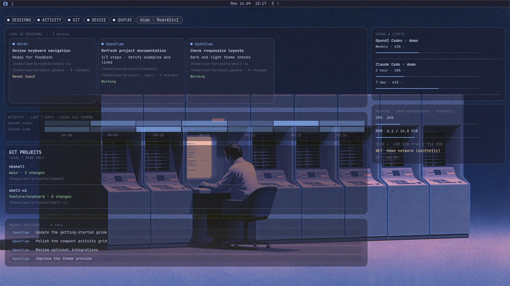
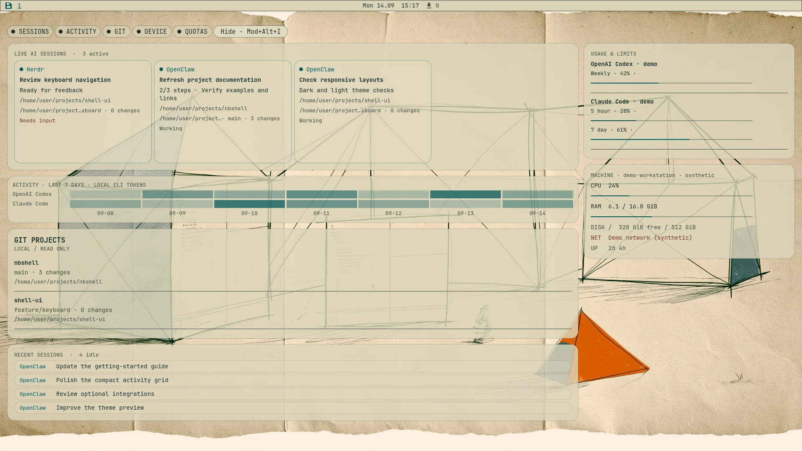

# nbshell

**A keyboard-first desktop shell for Umbriel — with a bar that can become an island, coherent themes, and an optional live Work Desk.**

[Getting started](docs/getting-started.md) · [Features](docs/features.md) · [Releases](https://github.com/nerdislb/nbshell/releases) · [Manual](docs/index.md) · [Feedback](https://github.com/nerdislb/nbshell/issues)



*Current `main` UI in an isolated Umbriel session. Session names, projects, activity,
quotas and machine readings above are synthetic demonstration data, not real
accounts or performance measurements. The wallpaper is bundled with nbshell.*

nbshell is an independent [Quickshell](https://quickshell.org) desktop shell for
[Umbriel](https://github.com/noctalia-dev/umbriel), aimed at Arch Linux users who
like a compact, terminal-inspired interface. It brings everyday desktop controls,
themes, window workflows and optional integrations together without replacing
normal Linux tools.

> nbshell is an independent project. It is not affiliated with, endorsed by,
> or an official part of Omarchy, Umbriel, or Quickshell. It takes visual and
> workflow inspiration from [Omarchy](https://omarchy.org); the optional Work Desk
> also takes layout inspiration from [Infomarchy](https://github.com/nixfred/infomarchy).

## Status

Current prerelease: **0.1.0-beta.12**. This is **active beta software**, not a
stable desktop release. Commands and configuration may change.

| Published beta 12 | Newer on `main` |
| --- | --- |
| OpenClaw setup, Theme Maker, Calendar app, Fork Updates, gaming setup improvements | Work dashboard, optional desktop Work Desk, shared session/Git data, compact daily activity grid, background Minecraft setup |

The screenshots show current `main`. To try the Work Desk now, use the source
checkout below; it is **not included in the beta 12 release archive**. See
[CHANGELOG.md](CHANGELOG.md) for the release boundary.

The project is developed with AI assistance. Product direction, testing and
acceptance remain human-led. Wider hardware testing and feedback are welcome.

## What makes it different?

- **Your bar, your shape.** Full-width bar, pill or collapsible island, with
  rearrangeable modules. The desktop cards are optional and independently switchable.
- **One visual language.** Dark/light themes, bundled original wallpapers,
  compatible Omarchy color files, Theme Maker and shared UI components.
- **A live Work Desk.** OpenClaw and Herdr sessions, progress, read-only Git
  summaries, provider quotas, daily local CLI activity and machine status —
  above the wallpaper, below normal windows.
- **Native Umbriel workflow.** Scrolling, dwindle and master layouts, overview,
  workspace navigation and persistent display configuration.
- **Everyday desktop tools.** Launcher, dashboard, clipboard, tray,
  notifications, audio, network, Bluetooth, capture, calendar, notes and tasks.
- **Optional extras, not requirements.** Mail, music, phone integration, gaming
  helpers and coding-agent workflows are discoverable without requiring every
  service to be installed or an AI account to use the desktop.

| Work Desk · light theme | Searchable menu | Theme Library |
| --- | --- | --- |
|  |  |  |

*Real rendered UI, not design mockups. See [media provenance](docs/project-media.md)
for the capture method and wallpaper attribution.*

## Try it

**Baseline:** current Arch Linux or an Arch-based system, a normal user with
`sudo`, Git, internet access and working Wayland graphics. Umbriel is the
supported compositor; nbshell is neither a distribution nor a compositor.

Use a test machine or keep TTY recovery and backups available while evaluating
the beta. Third-party QML plugins run with your user permissions. See
[compatibility and known limitations](docs/compatibility.md).

### Current source, including Work Desk

```bash
git clone https://github.com/nerdislb/nbshell.git
cd nbshell
./setup.sh
nbshell switch on
```

Run as your normal user, **not root**. Setup shows packages before invoking
`sudo`, installs the reviewed Umbriel/portal baseline, and deploys the shell.
Log out and select **Umbriel**. Existing personal nbshell configuration is
preserved on updates. `./setup.sh --full` adds the optional tool set.

If you manage dependencies yourself, use `./install.sh` to deploy files only.
Detailed setup, recovery and update instructions are in
[Getting started](docs/getting-started.md).

### Published beta

Use a [published release](https://github.com/nerdislb/nbshell/releases) or the
bootstrap described in the installation guide. Beta 12 includes the checksum
and Sigstore bundle required by the bootstrap. The bootstrap verifies the
release archive; it does not install the latest development checkout.

## First things to try

```bash
nbshell menu                 # Search the desktop's actions
nbshell modules              # Arrange the bar
nbshell store                # Themes, wallpapers and plugins
nbshell theme-maker          # Create a theme with a live preview
nbshell dashboard            # Overview, Calendar, Tools and Work
nbshell work on              # Optional desktop cards (current main)
nbshell work off             # Hide them and release their polling demand
nbshell work project /path/to/project
nbshell keys                 # Discover keyboard shortcuts
nbshell doctor               # Read-only diagnostic report
```

**Mod+Alt+I** toggles the Work Desk. Module switches and visibility persist
across restarts. Missing OpenClaw/Herdr services are reported, not started
implicitly; missing project directories are not guessed. Git probes never
fetch, stage, commit or push. The compact activity view is daily local CLI
usage, not an hourly heatmap or an OpenClaw conversation history.

[Work Desk details](docs/work-dashboard.md) · [AI/agent modes](docs/ai-agents.md)

## Explore the manual

| Topic | Guide |
| --- | --- |
| Installation, updates and recovery | [Getting started](docs/getting-started.md), [Troubleshooting](docs/troubleshooting.md) |
| Desktop and compositor features | [Features](docs/features.md), [Umbriel](docs/umbriel.md) |
| Themes and search | [Library and launcher](docs/library-search-and-demos.md), [Browser themes](docs/browser-themes.md) |
| Optional applications | [Integrations](docs/integrations.md), [Phone webcam](docs/phone-webcam.md) |
| Plugins | [Store](docs/plugin-store.md), [Development](docs/plugin-development.md) |
| Safety and data | [Privacy](PRIVACY.md), [Security](SECURITY.md), [Compatibility](docs/compatibility.md) |
| Contributing and testing | [Contributing](CONTRIBUTING.md), [Join the beta](docs/beta-invitation.md), [Support](SUPPORT.md) |

## Feedback welcome

I would especially like feedback on the desktop workflow, readable layouts at
smaller sizes, multi-monitor behavior and clean-install experiences. For bugs,
include the revision, Umbriel/Quickshell versions and a short reproduction.
Review logs and screenshots before sharing them. Please report vulnerabilities
privately through [SECURITY.md](SECURITY.md).

## Credits and license

MIT-licensed. See [LICENSE](LICENSE), [third-party notices](THIRD_PARTY.md) and
[theme attribution](themes/ATTRIBUTION.md). Bundled original wallpapers include
owner-contributed AI-generated artwork with
[documented provenance](wallpapers/MIDJOURNEY-PROVENANCE.md).

If you enjoy the project, you can support its development:

[](https://ko-fi.com/Y3G326ZLYS)
