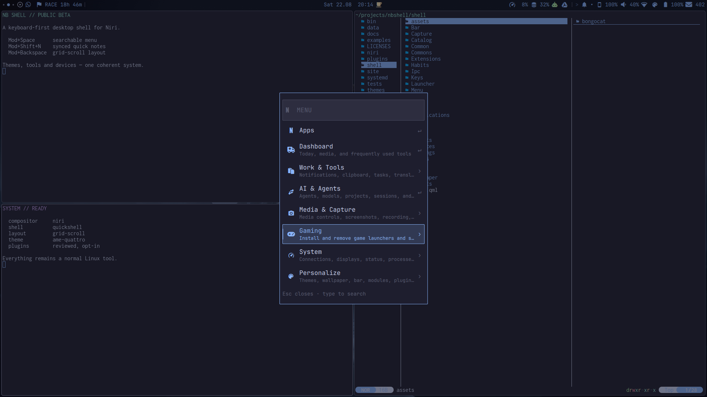
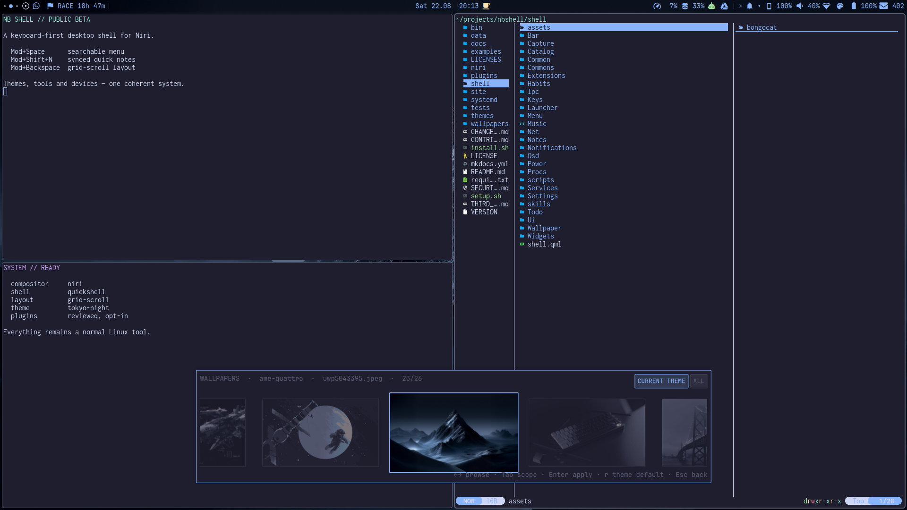
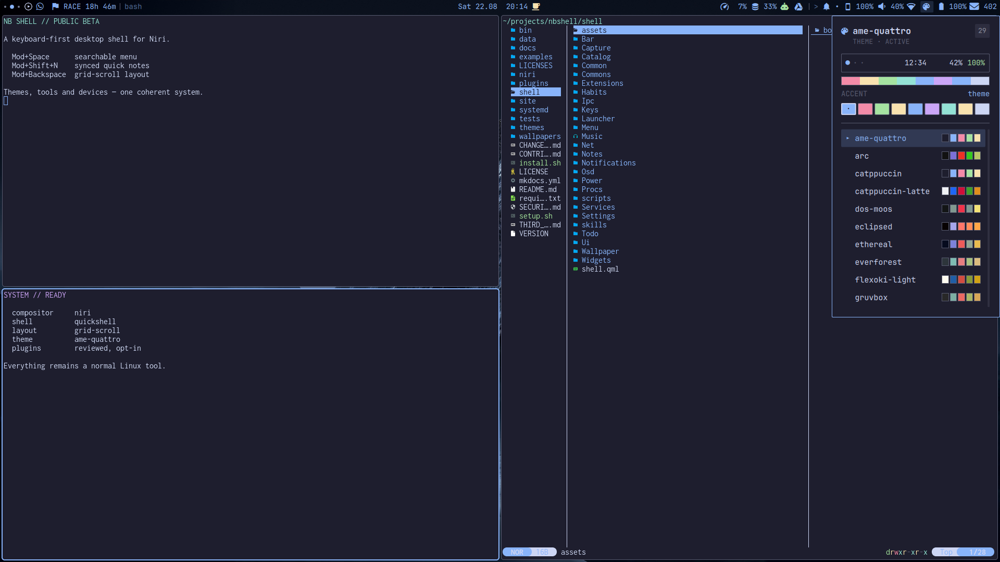
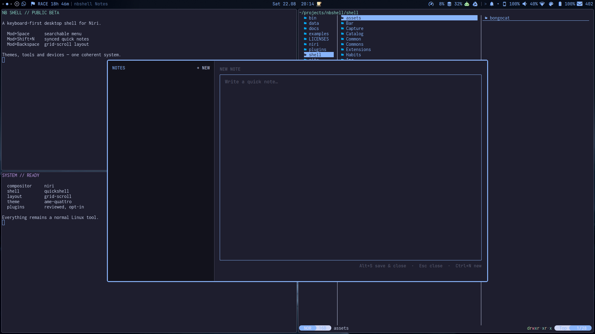

# nbshell

nbshell is an independent desktop shell for the
[niri](https://github.com/YaLTeR/niri) Wayland compositor. It is built with
[Quickshell](https://quickshell.org) and takes visual inspiration from
[Omarchy](https://omarchy.org). It does not require a full desktop environment.

> nbshell is an independent project. It is not affiliated with, endorsed by,
> or an official part of Omarchy, niri, or Quickshell. Project names are used
> only to describe inspiration and compatibility.

The project was created with AI-assisted development. Product decisions,
testing, and the direction of the project remain human-led.

> nbshell is still under active development. It already works as a daily
> desktop, but commands, configuration, and features may still change.

Current prerelease: **0.1.0-beta.1**. See the
[changelog](CHANGELOG.md) for user-facing changes.



## Why nbshell?

- **Grid-scroll without leaving Niri:** turn one workspace into compact
  two-window columns while other workspaces keep Niri's normal scrolling
  layout. A third window forms the next column instead of disturbing the first.
- **One theme across the desktop:** import compatible Omarchy themes or use the
  bundled independent collection; nbshell keeps the bar, menus, terminal,
  browser accents, lock screen, and wallpaper language coherent.
- **Linux tools remain Linux tools:** nbshell coordinates NetworkManager,
  PipeWire, systemd, grim, OBS, KDE Connect, and other existing components
  instead of replacing them with a closed desktop stack.
- **Desktop and phone can work together:** optional Android mirroring, phone
  webcam, nearby sharing, synchronized tasks, wallpapers, habits, and quick
  notes are available without making a phone mandatory.
- **Inspectable extensions:** bundled and third-party plugins expose their
  source, license, dependencies, and permissions; new plugins start disabled.
- **Safe shell updates:** the dashboard checks published nbshell releases,
  shows their notes, and verifies the release checksum before the normal,
  data-preserving installer runs in a visible terminal.
- **Keyboard first, mouse friendly:** the searchable menu reaches nested
  actions and installed applications, while every major surface remains
  directly addressable from a shortcut or CLI command.

| Wallpaper library | Theme picker | Floating quick notes |
| --- | --- | --- |
|  |  |  |

## Documentation

- [Manual](docs/index.md) — setup, features, browser themes, and video trimming
- [Getting started](docs/getting-started.md) — install, first login, and checks
- [Compatibility](docs/compatibility.md) — supported baseline and beta limitations
- [Beta testing](docs/beta-testing.md) — clean-machine and hardware checklist
- [Join the public beta](docs/beta-invitation.md) — tester profile, feedback, and media plan
- [Troubleshooting](docs/troubleshooting.md) — health checks and recovery
- [Plugin development](docs/plugin-development.md) — manifest, lifecycle, safety, and publishing
- [Plugin store](docs/plugin-store.md) — catalog format and review policy
- [Feature guide](docs/features.md) — what each part of nbshell does
- [Phone webcam](docs/phone-webcam.md) — use an Android camera in OBS or calls

The manual is intentionally split into short pages so it can grow into a clear
online guide without turning this README into a wall of text.

## What does it include?

- Island, pill, or full-width bar with freely arranged modules
- Searchable menu, application launcher, dashboard, themes, and wallpapers
- Clipboard history, notification center, and system tray
- Audio mixer, media controls, Bluetooth, Wi-Fi, batteries, power profiles,
  and persistent Niri display management
- Floating Picture-in-Picture controls for Zen Browser
- Theme-synchronized Hyprlock screen with PAM authentication and lock-before-suspend
- Calendar, tasks, quick notes, habits, KDE Connect, Android mirroring, and a phone webcam
- Screenshots, screen recording, OCR, QR scanning, and a screen saver
- AI usage for Codex, Claude, Antigravity, and other providers
- Curated plugin manager with optional modules, dependency details, update
  previews, and safe cleanup of external plugins
- Agent Center with a default-agent launcher, explicit approval profiles,
  project selection, Herdr sessions, and optional Ollama/OpenCode routing
- niri key bindings, terminal colors, and systemd autostart
- Optional herdr status inside the System & Plugins dashboard
- A release-based nbshell updater, kept separate from system and plugin updates

## Requirements

You need:

- Arch Linux or an Arch-based distribution
- A working niri Wayland session
- Git and an internet connection
- A normal user account with `sudo` access for package installation

The setup script installs Quickshell, the Nerd Font, and the other packages
used by the included modules. Optional hardware features only work when their
matching services or devices are available.

## Simple installation on Arch Linux

Open a terminal inside your running niri session. Do not run the script as
root.

```bash
git clone https://github.com/nerdislb/nbshell.git
cd nbshell
./setup.sh
```

The script installs the small desktop baseline and shows every package before
calling `sudo`. Optional tools remain discoverable but disabled. Use
`./setup.sh --full` when you want the complete capture, calendar, sync, power,
and hardware tool set in one pass.

When setup has finished, enable nbshell:

```bash
nbshell switch on
```

Then log out and back in. You can also start it immediately without logging
out:

```bash
nbshell start -d
```

Check the installation with:

```bash
nbshell switch status
```

## Install files only

If you manage packages yourself, use:

```bash
./install.sh
nbshell start
```

`install.sh` copies the shell and reports missing programs, but does not
install packages.

The installer keeps an existing niri configuration. If none exists, it creates
a small valid `~/.config/niri/config.kdl`. Existing personal nbshell settings
are not overwritten during later installations.

## First commands

```bash
nbshell menu             # Open the main menu
nbshell settings         # Change appearance and behavior
nbshell modules          # Arrange bar modules
nbshell plugin-manager   # Manage installed and optional plugins
nbshell plugin-store     # Browse the curated plugin catalog
nbshell keys             # Show key bindings
nbshell dashboard        # Open the dashboard
nbshell display          # Configure connected displays
nbshell ui-gallery       # Preview shared interface components
nbshell pip status       # Check Zen Picture-in-Picture
nbshell --help           # Show every command
```

Zen Browser opens its native Picture-in-Picture window with `Ctrl+Shift+]`.
nbshell makes that window floating and remembers its size and corner. Use the
`PIP` module or `Mod+Alt+P` to change its size. Use `Mod+Alt+Shift+P` to move it
to another corner.

## Wallpapers

Fresh installs include an original nbshell starter collection and enable the
Tokyo Night default wallpaper. The picker searches every theme collection,
so choosing a Gruvbox, Nord, or custom image never changes the active color
theme:

```bash
nbshell wallpaper pick
```

Collections live below `~/.local/share/nbshell/wallpapers/<theme>/`; synced
personal collections may use `~/Sync/nbshell/wallpapers/<theme>/`. An existing
Omarchy installation is not copied automatically. To reuse its images without
redistributing them, copy the desired files from `/usr/share/omarchy/themes/`
or `~/.config/omarchy/themes/` into an nbshell collection directory. The
picker discovers them the next time it opens.

Use the visible `CURRENT THEME` / `ALL` switch, or press `Tab`, to alternate
between the active theme's collection and the complete library. The picker
remembers the selected scope.

## Displays

Open `Displays` from the main menu, the Control Center, or run
`nbshell display`. The panel uses modes reported by Niri and can change each
output's resolution, scale, orientation, enabled state, and position relative
to another display. Changes apply live through `niri msg output` and are saved
in `~/.config/niri/nbshell-outputs.kdl`; nbshell never rewrites the rest of
your Niri configuration. It refuses to turn off the only active output.

The same backend is available without the shell UI:

```bash
nbshell display status
nbshell display set DP-1 scale 1.5
nbshell display set DP-1 transform 90
nbshell display place DP-1 right eDP-1
```

## Grid-scroll layout

Press `Mod+Backspace` to toggle a workspace-local grid on top of Niri's
scrolling layout. One or two tiled windows keep the normal Niri layout. The
third window creates a vertically split column beside one full-height column;
the fourth completes a 2x2 grid. The same progression repeats to the right in
groups of four. Floating windows and other workspaces are left alone.

Press `Mod+Backspace` again to return every tiled window on that workspace to
its own 50% column. The mode is intentionally session-local and does not alter
application data or Niri itself.

```bash
nbshell grid status
nbshell grid on
nbshell grid off
nbshell grid backend status
```

The controller follows Niri's event stream and only reacts to window or
workspace changes. It waits for every compositor-confirmed layout transition,
so opening and closing windows remains deterministic on slower systems too.
Niri currently exposes these layout operations as individual IPC actions; a
future atomic batch API would let nbshell remove the last intermediate frame
from uncommon full regrouping operations.

An opt-in atomic backend and its compositor prototype are documented in
[Grid-scroll development](docs/grid-scroll.md). Stock Niri and the stable
backend remain the default and recovery path.

## AI agents and local models

Press the physical `^/°` key beside `1` to drop down **Agent Quake**. It lists
live persistent sessions, shows recent terminal output, sends a next command to
an idle Codex, Claude, or Antigravity session, and starts a new project session.
Press the same key or `Esc` to hide it without stopping any work. The terminal
and process lifecycle remains in Herdr; nbshell does not copy prompts or
conversation history into shell state. See the [Agent Quake guide](docs/agent-quake.md).

Press `Mod+Shift+A` to open the default agent immediately in a focused floating
terminal. It starts in `~/projects/nbshell` when that checkout exists, so the
installed nbshell skill can guide customization. The full Agent Center remains
available through `AI & Agents`, a right-click on AI usage,
`Mod+Ctrl+Shift+A`, or the CLI:

```bash
nbshell agent center
nbshell agent doctor
nbshell agent list
nbshell agent default codex
nbshell agent quick
nbshell agent launch --project ~/projects/my-project
nbshell agent install copilot
nbshell commands --json
```

The Agent Center discovers supported tools instead of requiring all of them.
It currently recognizes Codex, Claude Code, Antigravity, OpenCode, Gemini CLI, GitHub
Copilot, and Pi. `safe`, `balanced`, and `autonomous` approval profiles map to
each tool's native controls. The explicitly selected `autonomous` profile uses
Codex's full approval-and-sandbox bypass; fresh installations therefore
continue to start in the safer `balanced` profile.

Model profiles route a default launch without changing individual agent
commands. `local` and `private` route through OpenCode, while `fast` and
`strong` default to Codex and Claude. Advanced users can set a concrete
OpenCode model in `~/.config/nbshell/agents.json`, for example:

```json
{
  "modelProfiles": {
    "local": { "agent": "opencode", "model": "ollama/qwen3.5:4b" }
  }
}
```

Ollama is optional and can be controlled after installation with
`nbshell agent ollama start|stop`. nbshell does not store provider credentials
or conversation history. The installer links the bundled nbshell system skill
into the common Codex, Claude, and cross-agent skill directories.

To expose an Ollama model to OpenCode, add a local provider to
`~/.config/opencode/opencode.jsonc`:

```jsonc
{
  "$schema": "https://opencode.ai/config.json",
  "provider": {
    "ollama": {
      "npm": "@ai-sdk/openai-compatible",
      "name": "Ollama (local)",
      "options": { "baseURL": "http://127.0.0.1:11434/v1" },
      "models": {
        "qwen3.5:4b": { "name": "Qwen 3.5 4B (local)" }
      }
    }
  }
}
```

Then run `ollama pull qwen3.5:4b` and verify the route with
`opencode models ollama`. Local models still need enough context for reliable
tool use; 16K to 32K is a practical starting range.

The `DEV`, `REVIEW`, and `PAIR` buttons in Agent Center create a new Herdr tab
for the selected project. From an existing Herdr pane, the same layouts are
available as `nbshell agent workspace dev|review|pair`. `DEV` creates an editor,
agent, and terminal layout. `REVIEW` adds a read-only review-agent pane. `PAIR`
adds a deliberately started second agent: the configured default remains the
lead and OpenCode uses the local route when available. The AI bar module shows
compact `RUN` and `WAIT` counts. Finished background agents and sessions
waiting for input create an actionable notification; its `Open session` action
focuses the matching Herdr pane. Codex uses its native lifecycle hook for
immediate completion and permission notifications, while other Herdr-supported
agents use the shared session watcher.

Missing agents show `INSTALL…` in the Agent Center. Selecting it opens a
terminal that displays the exact package command and asks for confirmation;
merely opening the panel never downloads or executes anything.

`nbshell commands --json` exposes the documented CLI as a versioned JSON
catalog so agents and scripts can discover supported commands without parsing
the shell source.

## Optional features

### Gaming setup

Open `Gaming` from the main menu (`Mod+Space`) to install or remove Steam,
RetroArch, Prism Launcher for Minecraft, NVIDIA GeForce NOW, Xbox Cloud
Gaming, Xbox controller support, Battle.net support through Lutris, Lutris,
Heroic, and Moonlight. A RetroArch game can also be added to the application
launcher.

Minecraft installation also creates a regular `Minecraft` app entry. It
launches the instance last selected in Prism directly. On a fresh setup Prism
opens once so you can sign in and create or import an instance; subsequent
launches go straight into the game.

Every setup action opens a terminal, shows what it will change, and asks for
confirmation. Package installs use the Arch repositories first and `paru` or
`yay` only when an AUR package is required. Personal game data is kept during
normal removal unless the terminal asks about a specific directory.

```bash
nbshell gaming status
nbshell gaming install steam
nbshell gaming remove steam
```

- Calendar data requires `khal`. Online calendar synchronization can be added
  with `vdirsyncer`.
- Task, quick-note, and wallpaper files can be synchronized with Syncthing.
  `Mod+Shift+N` opens the floating notes editor; `Alt+S` saves and closes it.
  Point `notesFile` at a synchronized directory with
  `nbshell set notesFile '~/Sync/nbshell/notes.json'`. nbOS reads the same
  `notes.json` from its existing shared data folder and merges entries by ID
  and update time, including deletion tombstones for offline-safe sync.
- Phone features require KDE Connect. Android mirroring and the optional phone
  webcam require ADB, `scrcpy`, and the separate `nbphone` tool. Webcam setup
  additionally installs `v4l2loopback-dkms`, matching kernel headers, and
  exposes the phone as `/dev/video10` for OBS and conferencing apps. The Phone
  panel can open a low-latency floating preview through `mpv` while capture is
  active.
- Live streaming opens OBS Studio from the Capture menu and therefore requires
  the optional `obs-studio` package. Stream credentials stay in OBS, not nbshell.
- The herdr panel requires a separately configured read-only bridge. The shell
  works normally without it.
- AUR update counts require `paru` or `yay`.
- After a successful dashboard update, nbshell recommends a restart only when
  core components such as the kernel, systemd, glibc, firmware, or graphics
  drivers changed. The dashboard keeps the English `Restart recommended`
  notice until the machine actually boots again.
- Local dictation is optional. Install `voxtype-bin` from the AUR, download a
  model with `voxtype setup --download --model small`, and enable its user
  service. `F9`, `nbshell dictate`, and `Capture → Toggle dictation` then start
  or stop recording. While recording or transcribing, the AI bar module shows
  the live state and also acts as a stop button. nbshell uses compositor
  control, so Voxtype's evdev hotkey can remain disabled.
- Omamail is bundled but disabled by default. Enable it with
  `nbshell plugin enable omamail`, restart nbshell, and open it with
  `Mod+Ctrl+Shift+G`. Gmail uses the official Gmail API and its setup page
  guides you through creating your own Google OAuth client. IMAP/SMTP accounts
  work with Fastmail, iCloud, Outlook, Yahoo, Zoho, GMX, Proton Bridge, and
  custom servers. Refresh tokens and mail passwords stay in the desktop
  keyring. Runtime tools are `curl`, `socat`, `openssl`, `xdg-open`, and
  `secret-tool` from `libsecret`.
- The native YouTube Music player is also bundled and disabled by default.
  Install `mpv` and `yt-dlp`, enable it with `nbshell plugin enable ytmusic`,
  restart nbshell, then press `Mod+Ctrl+Shift+M`. First launch creates an
  unprivileged Python venv and a systemd user service that is not enabled at
  login. Zen, Chromium, Chrome, and Brave sessions can be imported directly;
  the built-in request-header paste flow remains a fallback. Authentication
  files are stored with mode `0600`.

## Updating

```bash
cd nbshell
git pull --ff-only
./setup.sh --no-packages
nbshell restart
```

## Removing the integration

```bash
nbshell switch off
```

This disables nbshell autostart and removes its niri integration. It does not
delete your personal configuration or themes.

## Getting help

Run `nbshell --help` for command help. Bug reports and pull requests are
welcome. Please read [CONTRIBUTING.md](CONTRIBUTING.md) before contributing.
Report security problems privately as described in [SECURITY.md](SECURITY.md).

## Credits and license

nbshell takes visual and workflow inspiration from Omarchy, but it is an
independent implementation for niri and Quickshell. Theme sources are listed in
[themes/ATTRIBUTION.md](themes/ATTRIBUTION.md). Reused or adapted components
are documented in [THIRD_PARTY.md](THIRD_PARTY.md), with retained license texts
under [`LICENSES/`](LICENSES/THIRD_PARTY_MIT.md).

The remaining project is licensed under the [MIT License](LICENSE).
